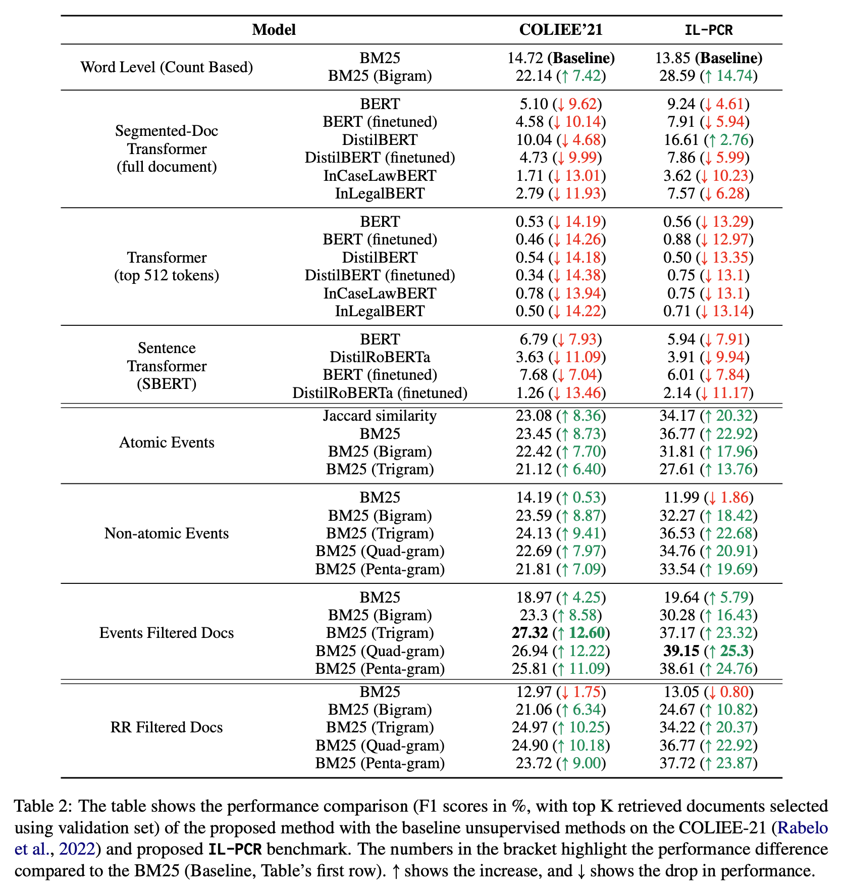

## `exp_results`

Results of each experiment run are stored here. Each experiment stores : 

1. `config_file.json` : The config file for the experiment contains details such as the path for the candidate/query cases, the labels file and the `n_gram` value. Please see the primary BM25 [README.md](../README.md) for details.

2. `scores.json` : Json containing the similarity score for each (query, candidate) pair.

3. `filled_similarity_matrix.csv` : pd.DataFrame object containing the BM25 similarity score for each (query, candidate) pair.

4. `output.json` : The evaluation metrics (`precision_vs_K`, `recall_vs_K`, `F1_vs_K`) for the experiment. For each query, the algorithm ranks the candidate pool and returns the top-`K` candidates as relevant. The precision/recall/F1 scores are obtained from comparing the candidates marked relevant against the ground truth labels.

### Results Summary

